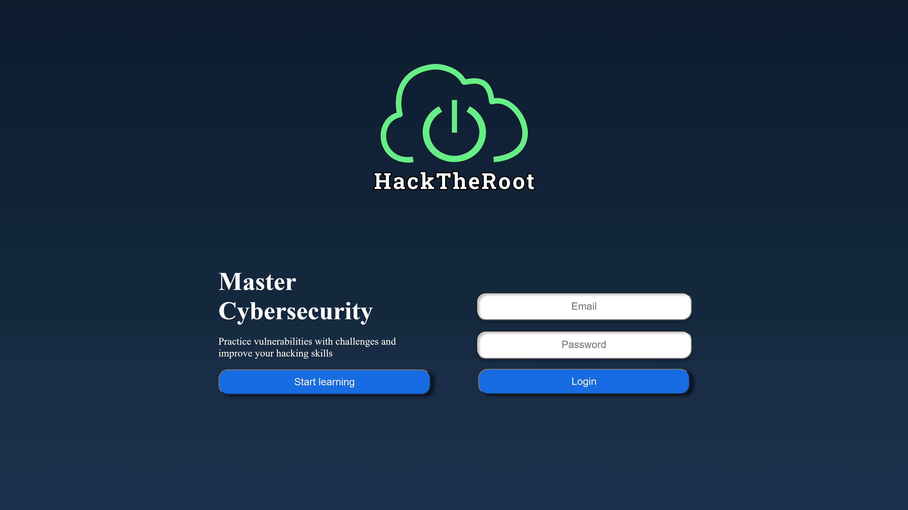
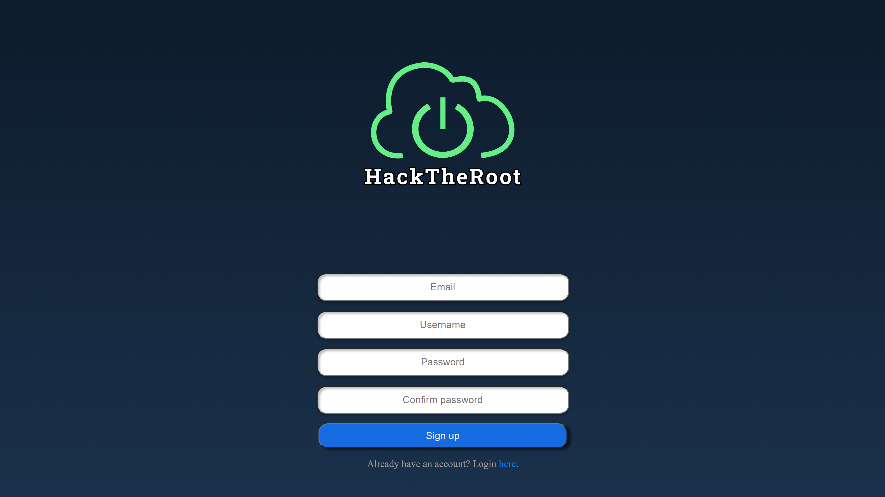
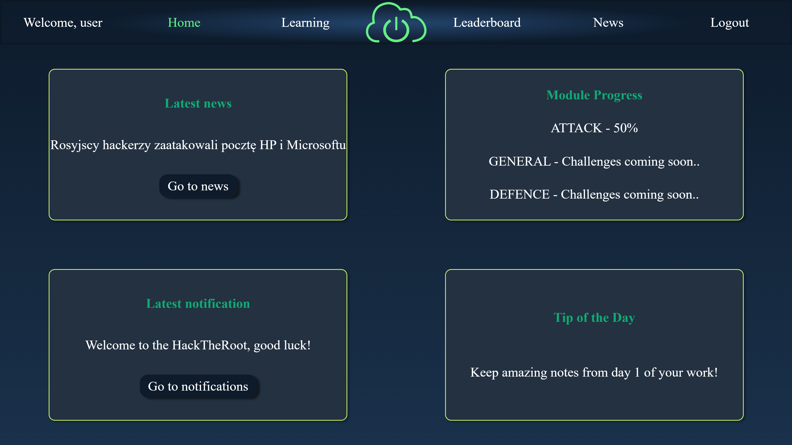
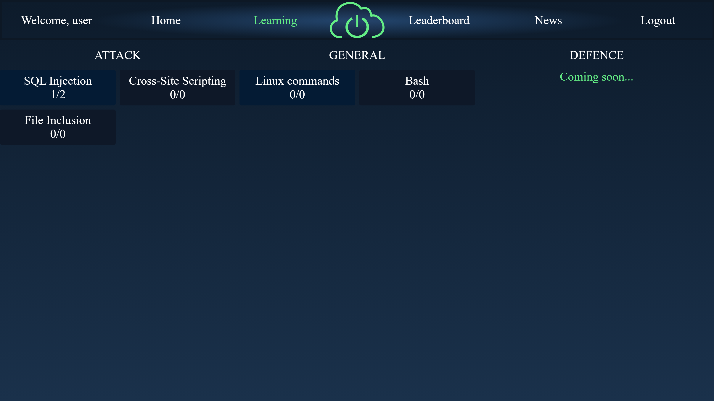
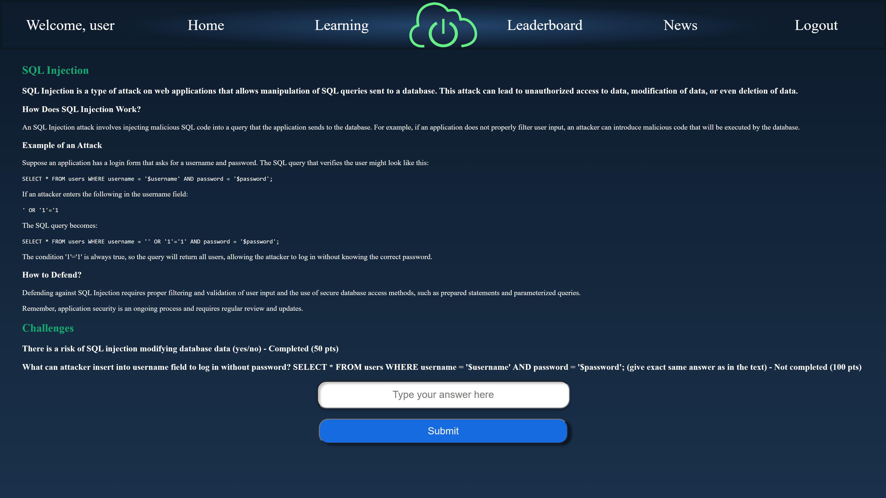
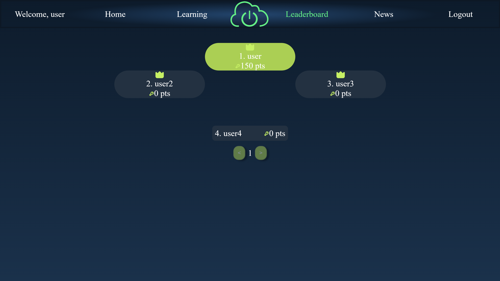
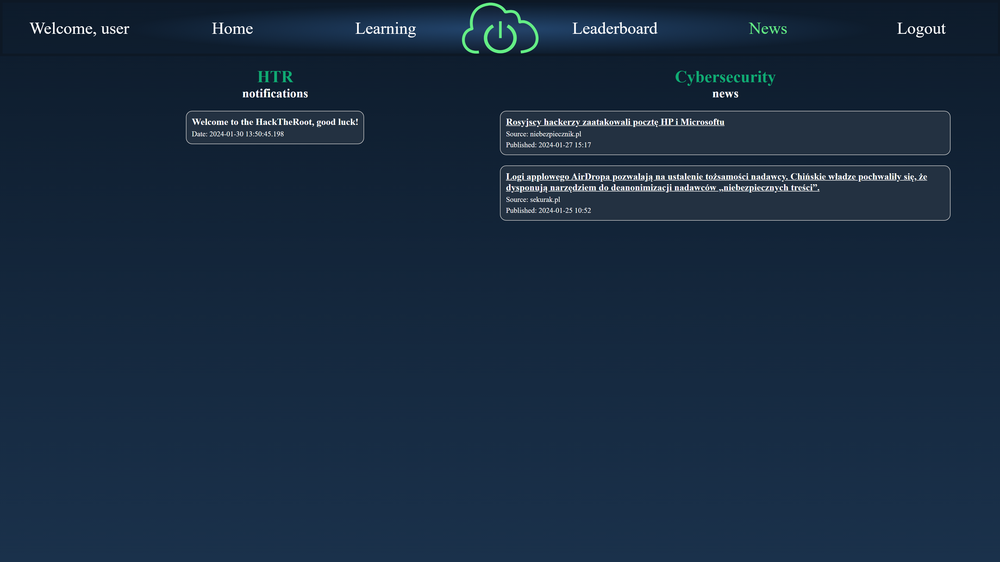
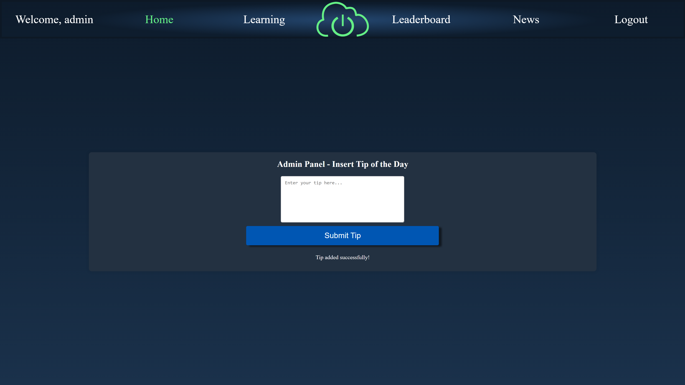
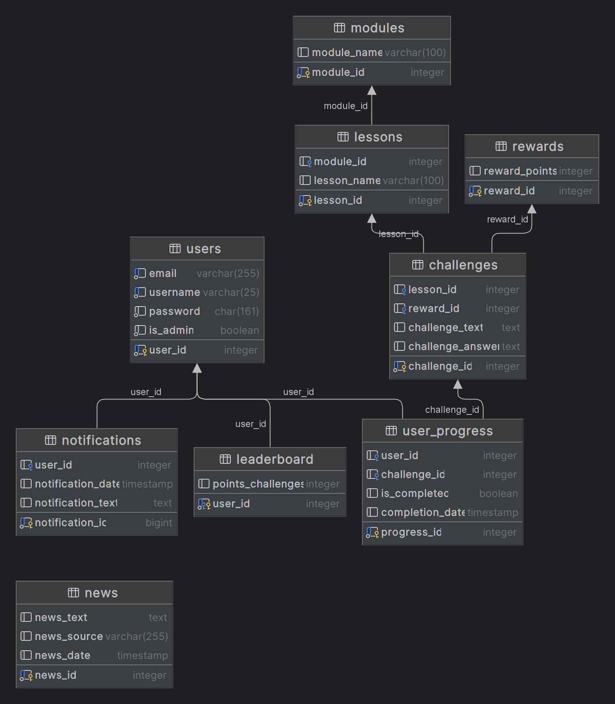

# HackTheRoot
A web application designed for learning cybersecurity through basic Capture The Flag (CTF) challenges.

This project was undertaken as a part of the coursework for fulfilling the requirements of a university subject.

## Prerequisites

To operate this application, it's essential to have the following tool installed:

- Docker: For detailed installation instructions, visit [this link](https://docs.docker.com/get-docker/).

## Tech Stack

- PHP
- HTML
- CSS
- JavaScript
- PostgreSQL
- Docker

## Setup

1. Begin by cloning this repository onto your local machine: `git clone https://github.com/xRastele/HackTheRoot.git`

2. Navigate into the cloned repository: `cd HackTheRoot`

3. Start the application using the following command: `docker-compose up`

4. Execute dbdump/dump.sql on the database (`localhost:5433`, db: `HackTheRoot`, login:pwd - `postgres:postgres`)

5. (Optional) Run `SELECT clear_few_tables();` in your DB console to clear tables: `users, leaderboard, news, notifications` or `SELECT clear_all_tables();` to clear them all

## Launching

Upon a successful initiation of the application with the `docker-compose up` command and importing data to database, you can access your website at:

[http://localhost:8080](http://localhost:8080)

## Customization

If you want to tailor Docker settings to your preferences, you can make adjustments by modifying the files `docker-compose.yml`, `nginx/nginx.conf`, or the `Dockerfile` located within the `php` and `nginx` directories.

## Screenshots of running application

### Login

### Register

### Home

### Learning

### SQL Injection Lesson

### Leaderboard

### News

### Admin

### ER Diagram

